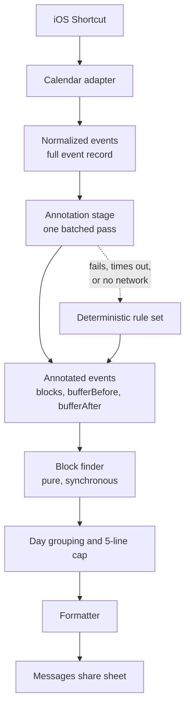

# Mobile Availability Generator - Plan

## Goal Capsule

- **Objective:** From an iPhone, in one action and without typing, produce the owner's next open days as a short block of plain text and hand it to Messages.
- **Means:** An iOS Shortcut invokes a Scriptable script that reads Apple Calendar on-device and calls a platform-independent JavaScript module for the availability rules and formatting.
- **Product authority:** Single user, single device, personal use. No other users, no accounts, no published product. Inference-driven behavior is named here only as the seam it will plug into; both inference features are separate work.
- **Open blockers:** None.

---

## Product Contract

### Summary

Rebuild `avail` as a phone-first tool: one tap on iOS renders the next five days that have open time as five lines of text and opens the Messages share sheet with it. The availability rules, block finding, and formatting live in a platform-independent JavaScript module; iOS is a thin adapter over it. A single annotation stage sits between reading the calendar and computing blocks, so later AI-driven buffer and all-day-event behavior drops in without touching anything downstream.

### Problem Frame

Sending someone your availability is a thirty-second interruption in the middle of a text conversation, and every existing path costs more than that. Opening the Calendar app and reading the week off the screen means transcribing times by hand and getting them wrong. Scheduling links move the work to the other person and read as bureaucratic between people who just want to pick a time. The original `avail` solved the formatting problem well — its compact one-line-per-block output is still the thing worth sending — but it only ran as a Node CLI fed a JSON dump from a Google Calendar OAuth server, so it was never reachable at the moment the question gets asked. The gap is not the computation. It is that the computation is nowhere near the phone.

### Key Decisions

- **Generation runs on-device through Shortcuts and Scriptable.** (session-settled: user-directed — chosen over a hosted thin server and an iCloud CalDAV daemon: the deterministic list still generates with no signal, and only annotation ever needs the network.) Governs R16, R24, R25.
- **One fixed rule set, no invocation-time prompts.** (session-settled: user-directed — chosen over preset variants and per-run prompting: speed mid-conversation beats flexibility.) Governs R14.
- **One line per day, capped at five.** (session-settled: user-directed — chosen over one line per block, collapsing identical runs, and longest-first selection: the message stays glanceable, and day granularity still reaches late in the window when early days are booked.) Governs R9, R10, R11.
- **The line cap binds, not the horizon.** (session-settled: user-directed — chosen over returning fewer lines or an empty result when the week is full: five real days are always more useful than a short list, and any day past the last calendar event is fully open, so the search always terminates.) Governs R2a, R11.
- **Native share to Messages, not the clipboard.** (session-settled: user-directed — chosen over copy-and-paste: fewer taps at the moment of use.) Governs R15.
- **Annotation is a single pre-pass over events, never a call inside block finding.** (session-settled: user-approved — chosen over resolving buffers inline during the scan: keeps block finding pure, synchronous and snapshot-testable once inference lands.) Governs R17, R18, R23.
- **The event model captures the full event record.** (session-settled: user-directed — chosen over times-and-location-only and a locally-computed in-person flag: privacy is not a constraint here, and full detail leaves the most headroom for later semantic features.) Governs R22.
- **Both inference-dependent behaviors are deferred, and they share one seam.** (session-settled: user-directed — distance-based buffer durations and treating travel and conference all-day events as blocking are separate tasks; this work builds only what they plug into.) Governs R19, R20.
- **The day window widened from the original, and weekends stayed in.** (session-settled: user-directed — chosen over the original's 9-to-5 and over weekdays-only: weekends are ordinary available days.) Governs R1.
- **The existing Google OAuth server and stdin CLI are replaced rather than extended.** Only the block-finding logic and the output format carry forward; the repository's current shape is not a precedent.

### Pipeline shape

The annotation stage is the only place inference will ever run. Everything downstream of it is a pure function of its output, which is what keeps the deterministic path testable after inference lands.

### Requirements

**Availability rules**

- R1. Free time is computed within a daily window of 9:00am to 7:00pm local time, on every day of the week including weekends.
- R2. The preferred window is the next 7 days from the moment of invocation, extended to 8 or 9 days when day 7 would fall on a Monday or Tuesday, so the preferred window never ends on either of those days.
- R2a. The preferred window is not a ceiling: when it holds fewer than five qualifying days, the search continues day by day past it until five qualifying days are found.
- R3. A free block shorter than one hour is not offered.
- R4. Today's availability begins at the current time rounded up to the next half hour.
- R5. Every calendar blocks availability except those named in a configured exclusion list, which currently holds `Supportive and Nourishing Structure`.
- R6. All-day events never block availability.
- R7. Declined invitations do not block availability; tentatively accepted events do.
- R8. Each blocking event excludes a buffer before and after itself from availability, currently 15 minutes on each side.

**Output format**

- R9. Availability renders one line per day: the day's date prefix once, followed by all of that day's free blocks separated by commas.
- R10. A day with no qualifying free block produces no line.
- R11. Exactly five lines are emitted whenever the calendar permits, taken in chronological order, with any remainder inside the preferred window dropped and no truncation marker.
- R12. Block times use the original compact form `h[:mm]am/pm`, with the start's am/pm suffix omitted when that block's start and end fall in the same half of the day.
- R13. Times render in the device's local timezone with no timezone label.

**Invocation and delivery**

- R14. Generation is invoked from the iPhone in a single action, with no prompt for hours, horizon, or any other parameter.
- R15. The generated text is handed to the native iOS share sheet targeting Messages.
- R16. The deterministic result is produced entirely on-device and completes with no network connection.

**Annotation seam**

- R17. A single annotation stage runs after events are read and before free-block computation, returning for each event whether it blocks and its before and after buffer durations.
- R18. The annotation stage resolves every event in the window in one batched pass, not one call per event.
- R19. The shipped annotator is a deterministic rule set implementing R6, R7 and R8, and is replaceable without changes downstream of it.
- R20. When an annotator errors, times out, or has no network, the deterministic rule set supplies the annotation and generation completes normally.
- R21. Annotation results derived from a stable external fact are cached across invocations, keyed on the inputs that determine them.
- R22. The normalized event model captures the full event record: title, notes, location, conferencing URL, attendees, calendar, start, end, all-day flag, and response status.
- R23. Free-block computation consumes only event times and the annotation stage's output, and is a pure synchronous function of them.

**Portability**

- R24. The availability rules, block finding, and formatting live in a JavaScript module with no platform dependencies, runnable and testable under Node.
- R25. The iOS integration is a thin adapter that reads events, calls the module, and returns text; replacing the adapter requires no change to the module.

### Key Flows

- F1. Generate and share availability
  - **Trigger:** Owner invokes the shortcut from the phone mid-conversation.
  - **Steps:** The adapter reads events across the horizon per R2 and normalizes them per R22; the annotation stage resolves blocking and buffers per R17; the block finder computes free blocks within the daily window; days are grouped and capped per R9 through R11; the formatter renders the text per R12 and R13; the share sheet opens targeting Messages.
  - **Outcome:** At most five lines of availability text sit in a Messages draft.
  - **Covered by:** R1-R16, R22, R23.
- F2. Annotation unavailable
  - **Trigger:** The annotator errors, exceeds its time budget, or the device has no network.
  - **Steps:** The deterministic rule set supplies annotations for every event; the rest of F1 proceeds unchanged.
  - **Outcome:** The owner gets the deterministic list with no error surfaced and no missing days.
  - **Covered by:** R19, R20.

### Acceptance Examples

- AE1. **Covers R2.** Given today is Monday, when availability is generated, then the horizon spans 9 days so the window ends on Wednesday.
- AE2. **Covers R2.** Given today is Tuesday, when availability is generated, then the horizon spans 8 days so the window ends on Wednesday.
- AE3. **Covers R2.** Given today is Thursday, when availability is generated, then the horizon spans exactly 7 days.
- AE4. **Covers R9, R12.** Given Tuesday has a meeting from 2:30pm to 3:30pm and no other events, when the line renders, then it reads `Tue 7/11 9am-2:15pm, 3:45-7pm`.
- AE5. **Covers R10, R11.** Given the first two days of the window are fully booked and the following six are open, when availability renders, then the first line is day 3 and exactly five lines are emitted, ending at day 7.
- AE5a. **Covers R2a.** Given every day in the preferred window is fully booked and the five days after it are open, when availability renders, then five lines are emitted for those later days rather than an empty result.
- AE5b. **Covers R2a.** Given only two days inside the preferred window qualify, when availability renders, then the search continues past the window until five qualifying days are found.
- AE6. **Covers R3.** Given Wednesday has meetings leaving only a 45-minute gap and a 3-hour gap, when the line renders, then only the 3-hour block appears.
- AE7. **Covers R6.** Given Thursday holds an all-day event and no timed events, when the line renders, then it reads as fully open for the whole 9am-7pm window.
- AE8. **Covers R5.** Given Friday holds a 10am event on the `Supportive and Nourishing Structure` calendar and no other events, when the line renders, then it reads as fully open.
- AE9. **Covers R7.** Given Saturday holds one declined invitation and one tentatively accepted event, when the line renders, then only the tentative event removes time.
- AE10. **Covers R4.** Given it is 2:10pm today, when availability is generated, then today's first block starts at 2:30pm.
- AE11. **Covers R20.** Given the annotator throws on every event, when availability is generated, then the output is identical to a run with the deterministic rule set and no error reaches the share sheet.

### Success Criteria

- Tap to populated share sheet completes in a few seconds in airplane mode.
- The module's behavior is pinned by tests that run under Node with no iOS involvement, using fixture event lists.
- Introducing the distance-based buffer annotator later requires changes only inside the annotation stage — not in block finding, day grouping, formatting, or the adapter.
- Replacing the iOS adapter with a different host requires no change to the module.

### Scope Boundaries

- Distance-based buffer durations, and the carve-out that makes travel and conference all-day events blocking, are both separate work. This plan builds the seam and the deterministic annotator only.
- Semantic or fuzzy qualifiers ("mornings only", "after my trip") are out. Generation is fully deterministic.
- Email injection is out, though R24 and R25 keep it cheap later.
- Any server, daemon, hosted endpoint, or CalDAV path is out.
- Multi-user support, accounts, authentication, publishing, and anything intended for other people's use are out.
- The existing Express OAuth server, Google Calendar integration, and stdin CLI are removed rather than migrated.

### Dependencies / Assumptions

- Scriptable is installed on the device and granted calendar access, and the Shortcuts app can invoke it and receive its text output.
- Scriptable is maintained by a single developer and has historically lagged new iOS releases by a couple of months. R24 and R25 exist to bound that risk: the module survives an adapter swap.
- The script is authored on a Mac and reaches the device through iCloud Drive; the phone is not an editing surface.
- All of the owner's calendars are reachable from Apple Calendar on the device.
- The buffer in R8 is symmetric and uniform today only because the deterministic annotator makes it so; nothing downstream assumes symmetry.

### Outstanding Questions

**Deferred to Planning**

- Which invocation surface the shortcut uses — home screen icon, share sheet, Back Tap, or several.
- Where configuration lives and its shape, given it must be editable without a Mac round-trip.
- How the R21 cache persists on-device and when entries expire.
- Whether the comma separator in R9 is the right glue for a day with three or more blocks.
- How far forward the R2a search may run before it is treated as a fault rather than a genuine answer.

### Sources / Research

- `find-free-blocks.js` — the recursive free-block finder and the formatter carried forward, including the per-block am/pm elision in `formatBlockStart` and the original defaults (9am-5pm, all seven days, 1-hour minimum, 7-day span). Dependency-free; the basis for R24.
- `index.js` — the Express, Passport, and Google Calendar OAuth server being removed.
- `bin.js` — the stdin/file JSON CLI being removed.
- `test/spec.js` — existing mocha and chai coverage of `flattenEvents` and `printFreeBlocks`, and the fixture shape tests can build on.
- [Scriptable](https://scriptable.app/) and its [Script API](https://docs.scriptable.app/script/) — `Script.setShortcutOutput()` returns text from a script to a calling shortcut, which is the mechanism R25 depends on.
- [Intro to Find and Filter actions in Shortcuts](https://support.apple.com/guide/shortcuts/intro-to-find-and-filter-actions-apd3c845e881/ios) and [Shortcuts Rewind: Dates, Calendars, and Beyond](https://www.macstories.net/stories/shortcuts-rewind-dates-calendars-and-beyond/) — confirm native on-device calendar reads with per-calendar and date-range filtering, establishing that no server is required.
