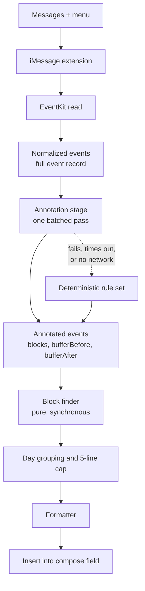
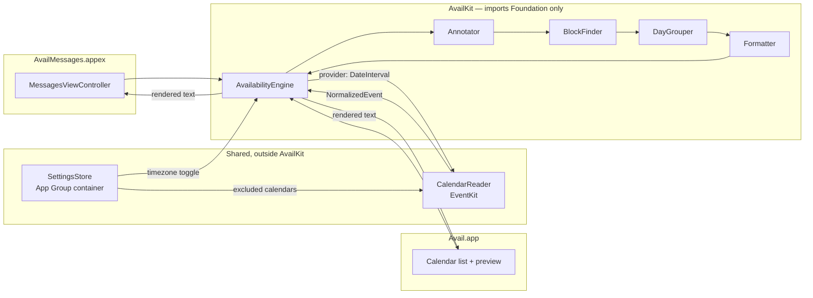
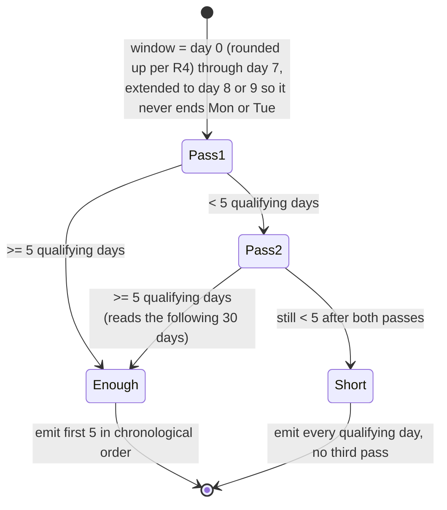

# Mobile Availability Generator - Plan

## Goal Capsule

- **Objective:** From inside a Messages conversation, in two taps and without typing, drop the owner's next open days into the compose field as plain text.
- **Means:** A native iOS app whose iMessage extension appears in the Messages `+` menu, reading Apple Calendar through EventKit and computing availability in Swift.
- **Product authority:** Single user, single device, personal use. No other users, no accounts, no App Store distribution. Inference-driven behavior is named here only as the seam it will plug into; both inference features are separate work.
- **Open blockers:** None.

---

## Product Contract

### Summary

Rebuild `avail` as a native iOS app. Its iMessage extension sits in the Messages `+` menu; tapping it inserts the next five days that have open time into the compose field, one line per day, in the original text format. Everything runs on-device in Swift. A single annotation stage sits between reading the calendar and computing blocks, so later AI-driven buffer and all-day-event behavior drops in without touching anything downstream.

### Problem Frame

Sending someone your availability is a thirty-second interruption in the middle of a text conversation, and every existing path costs more than that. Opening the Calendar app and reading the week off the screen means transcribing times by hand and getting them wrong. Scheduling links move the work to the other person and read as bureaucratic between people who just want to pick a time. The original `avail` solved the formatting problem well — its compact output is still the thing worth sending — but it only ran as a Node CLI fed a JSON dump from a Google Calendar OAuth server, so it was never reachable at the moment the question gets asked. The gap is not the computation. It is that the computation is nowhere near the conversation.

### Key Decisions

- **A native iOS app with an iMessage extension.** (session-settled: user-directed — chosen over a Shortcuts-and-Scriptable path, and over shipping the Shortcut first with the extension later: the Messages `+` menu is populated only by iMessage app extensions, and that entry point is the point.) Governs R14, R15, R16.
- **The whole implementation is Swift.** (session-settled: user-directed — chosen over running the existing JavaScript through JavaScriptCore, and over keeping the JS as a cross-check oracle: one language and full Xcode debugging beat reusing the old module.) Governs R24, R25.
- **One fixed rule set, no invocation-time prompts.** (session-settled: user-directed — chosen over preset variants and per-run prompting: speed mid-conversation beats flexibility.) Governs R14.
- **One line per day, capped at five.** (session-settled: user-directed — chosen over one line per block, collapsing identical runs, and longest-first selection: the message stays glanceable, and day granularity still reaches late in the window when early days are booked.) Governs R9, R10, R11.
- **A day's line carries at most three blocks.** (session-settled: user-directed — chosen over printing every block and over skipping fragmented days entirely: a chopped-up day still belongs in the list, but its slivers are not worth a reader's attention.) Governs R9a.
- **The line cap binds, not the horizon.** (session-settled: user-directed — chosen over returning fewer lines or an empty result when the week is full: five real days are always more useful than a short list, and any day past the last calendar event is fully open, so the search always terminates.) Governs R2a, R11.
- **Annotation is a single pre-pass over events, never a call inside block finding.** (session-settled: user-approved — chosen over resolving buffers inline during the scan: keeps block finding pure, synchronous and snapshot-testable once inference lands.) Governs R17, R18, R23.
- **The event model captures the full event record.** (session-settled: user-directed — chosen over times-and-location-only and a locally-computed in-person flag: privacy is not a constraint here, and full detail leaves the most headroom for later semantic features.) Governs R22.
- **Both inference-dependent behaviors are deferred, and they share one seam.** (session-settled: user-directed — distance-based buffer durations and treating travel and conference all-day events as blocking are separate tasks; this work builds only what they plug into.) Governs R19, R20.
- **The day window widened from the original, and weekends stayed in.** (session-settled: user-directed — chosen over the original's 9-to-5 and over weekdays-only: weekends are ordinary available days.) Governs R1.
- **The containing app carries the calendar selection and a live preview.** (session-settled: user-directed — chosen over a permission-prompt-only shell, a full settings screen, and preview-only: calendars come and go while hours never change, and the preview verifies a rule change without texting yourself.) Governs R26, R27, R28.
- **The timezone label is a toggle in the extension's own view, not a prompt or a global setting.** (session-settled: user-directed — chosen over a switch in the containing app and over always appending it: the zone matters per recipient, and the extension already renders a view, so a toggle costs a tap only when it is wanted.) Governs R13a.
- **A calendar's own Show As field is honored.** (session-settled: user-directed — chosen over blocking everything that has a time on it, and over honoring it only on events the owner created: it is a per-event override that needs no new configuration.) Governs R7a.
- **The repository is replaced, not extended.** The Google OAuth server, the stdin CLI, and the JavaScript implementation all go. The block-finding algorithm and the output format are the only things that survive, and they survive as a specification to reimplement rather than as code.

### Pipeline shape



Swift owns everything with a side effect: the EventKit read, any network the annotator later needs, and the insertion. The annotation stage is the only place inference will ever run, and everything downstream of it is a pure function of its output.

### Requirements

**Availability rules**

- R1. Free time is computed within a daily window of 9:00am to 7:00pm local time, on every day of the week including weekends.
- R2. The preferred window begins with today as day 0, starting at R4's rounded-up time, and runs through the end of day 7, extended through the end of day 8 or day 9 when day 7 falls on a Monday or Tuesday, so the preferred window never ends on either of those days.
- R2a. The preferred window is not a ceiling. Events are read and annotated for the preferred window in a single pass; when fewer than five days qualify within it, one further pass reads and annotates the following 30 days and the search continues into them.
- R2b. When fewer than five days qualify across both passes, every qualifying day is emitted and no further pass runs.
- R3. A free block shorter than one hour is not offered.
- R4. Today's availability begins at the current time rounded up to the next half hour.
- R5. Every calendar blocks availability except those the owner has excluded in the containing app; `Supportive and Nourishing Structure` is excluded at first run.
- R6. All-day events never block availability.
- R7. Declined invitations do not block availability; tentatively accepted events do.
- R7a. An event whose Show As field reads Free does not block availability, whoever owns it.
- R8. Each blocking event excludes a buffer before and after itself from availability, currently 15 minutes on each side.

**Output format**

- R9. Availability renders one line per day: the day's date prefix once, followed by that day's free blocks separated by commas, subject to the per-day limit in R9a.
- R9a. At most three blocks appear on a day's line; when a day has more, the three longest are kept and rendered in chronological order, with ties in length broken by the earlier start.
- R10. A day with no qualifying free block produces no line.
- R11. Five lines are emitted whenever R2a's two passes supply five qualifying days, taken in chronological order, with any remainder dropped and no truncation marker.
- R12. Block times use the original compact form `h[:mm]am/pm`, with the start's am/pm suffix omitted when that block's start and end fall in the same half of the day.
- R13. Times render in the device's local timezone, with no timezone label by default.
- R13a. The extension offers a toggle that appends the local timezone's generic short name — the season-independent `ET` form, not `EDT` or `EST` — to the end of every line; it is off by default and retains its last state between invocations.

**Invocation and delivery**

- R14. The iMessage extension appears in the Messages `+` menu and generates availability on a single tap, with no prompt for hours, horizon, or any other parameter.
- R14a. When calendar access is absent, denied, or write-only, the extension reports the permission state rather than rendering availability.
- R15. The generated text is inserted into the active conversation's compose field, leaving the owner to review, edit, and send.
- R16. The deterministic result is produced entirely on-device and completes with no network connection.
- R16a. The extension shows an indeterminate progress indicator from the moment it is tapped until the rendered lines replace it, so its view is never blank.

**Annotation seam**

- R17. A single annotation stage runs after events are read and before free-block computation, returning for each event whether it blocks and its before and after buffer durations.
- R18. The annotation stage resolves every event in the window in one batched pass, not one call per event.
- R19. The shipped annotator is a deterministic rule set implementing R6, R7, R7a and R8, and is replaceable without changes downstream of it; a replacement preserves those rules except where the deferred all-day carve-out changes R6.
- R20. When an annotator errors, times out, or has no network, the deterministic rule set supplies the annotation and generation completes normally.
- R22. The normalized event model captures the full event record: title, notes, location, attendees, calendar, start, end, all-day flag, and response status, plus a conferencing URL derived from the event's url, location and notes, since EventKit exposes no conference property of its own.
- R23. Free-block computation consumes only event times and the annotation stage's output, and is a pure synchronous function of them.

**Containing app**

- R26. The containing app lists the device's calendars and lets the owner mark each as blocking or excluded, and the extension reads that selection. The selection is keyed on each calendar's stable EventKit identifier so a rename does not change its state; R5's named exclusion is matched by name once at first run.
- R27. The containing app displays the exact text the extension would produce at that moment, and copies it to the pasteboard in one tap.
- R27a. The containing app requests calendar access when its calendar screen first appears and, until full access is granted, shows an explicit prompt to grant it in place of the calendar list.
- R28. The daily window, the line cap, the minimum block, and the buffer durations are build-time constants, not editable on-device.

**Structure**

- R24. The availability rules, block finding, and formatting live in a Swift module that imports neither EventKit nor any UI framework, and is exercised directly by unit tests over fixture event lists.
- R25. The iMessage extension and its containing app are shells over that module: the EventKit read, the compose-field insertion, and any future network call live outside it.
- R25a. The calendar selection from R26 and the timezone toggle state from R13a are shared between the containing app and the extension.

### Key Flows

- F1. Generate and insert availability
  - **Trigger:** Owner taps `+` in a Messages conversation and selects the extension.
  - **Steps:** The extension reads events across the horizon per R2 and R2a and normalizes them per R22; the annotation stage resolves blocking and buffers per R17; the block finder computes free blocks within the daily window; days are grouped and capped per R9 through R11; the formatter renders the text per R12, R13 and R13a; the extension displays the text alongside the timezone toggle; the owner taps to insert it.
  - **Outcome:** Five lines of availability sit in the compose field, unsent.
  - **Covered by:** R1-R17, R22, R23.
- F2. Annotation unavailable
  - **Trigger:** The annotator errors, exceeds its time budget, or the device has no network.
  - **Steps:** The deterministic rule set supplies annotations for every event; the rest of F1 proceeds unchanged.
  - **Outcome:** The owner gets the deterministic list with no error surfaced and no missing days.
  - **Covered by:** R19, R20.
- F3. Adjust which calendars block
  - **Trigger:** Owner opens the containing app after adding or renaming a calendar.
  - **Steps:** The app lists every calendar on the device with its current blocking state; the owner toggles one; the preview re-renders against the new selection.
  - **Outcome:** The selection is stored where the extension reads it, and the preview shows what the next invocation will produce.
  - **Covered by:** R5, R25a, R26, R27.
- F4. Calendar access not yet granted
  - **Trigger:** The extension runs without full calendar access, whether the grant is absent, denied, or write-only.
  - **Steps:** The extension surfaces which of those states applies rather than an empty result, and names the remedy: granting through the containing app for an absent grant, or switching Calendars to Full Access in Settings for a write-only one.
  - **Outcome:** The owner understands why no availability appeared and can fix it, and never sends a falsely wide-open week.
  - **Covered by:** R14a.

### Acceptance Examples

- AE1. **Covers R2.** Given today is Monday, when availability is generated, then the preferred window spans 9 days so it ends on Wednesday.
- AE2. **Covers R2.** Given today is Tuesday, when availability is generated, then the preferred window spans 8 days so it ends on Wednesday.
- AE3. **Covers R2.** Given today is Thursday, when availability is generated, then the preferred window spans exactly 7 days.
- AE4. **Covers R9, R12.** Given Tuesday has a meeting from 2:30pm to 3:30pm and no other events, when the line renders, then it reads `Tue 7/11 9am-2:15pm, 3:45-7pm`.
- AE5. **Covers R10, R11.** Given the first two days of the window are fully booked and the following six are open, when availability renders, then the first line is day 3 and exactly five lines are emitted, ending at day 7.
- AE5a. **Covers R2a.** Given every day in the preferred window is fully booked and the five days after it are open, when availability renders, then five lines are emitted for those later days rather than an empty result.
- AE5b. **Covers R2a.** Given only two days inside the preferred window qualify, when availability renders, then a second pass reads the following 30 days and the search continues into them until five qualifying days are found.
- AE5d. **Covers R2b.** Given fewer than five days qualify across the preferred window and the 30-day second pass, when availability renders, then only the qualifying days are emitted and no third pass runs.
- AE5c. **Covers R9a.** Given Wednesday has five qualifying free blocks, two of them the same length, when the line renders, then only the three longest appear in chronological order, the earlier of the tied pair winning.
- AE6. **Covers R3.** Given Wednesday has meetings leaving only a 45-minute gap and a 3-hour gap, when the line renders, then only the 3-hour block appears.
- AE7. **Covers R6.** Given Thursday holds an all-day event and no timed events, when the line renders, then it reads as fully open for the whole 9am-7pm window.
- AE8. **Covers R5.** Given Friday holds a 10am event on the `Supportive and Nourishing Structure` calendar and no other events, when the line renders, then it reads as fully open.
- AE9. **Covers R7.** Given Saturday holds one declined invitation and one tentatively accepted event, when the line renders, then only the tentative event removes time.
- AE10. **Covers R4.** Given it is 2:10pm today, when availability is generated, then today's first block starts at 2:30pm.
- AE11. **Covers R20.** Given the annotator throws on every event, when availability is generated, then the output is identical to a run with the deterministic rule set and no error reaches the compose field.
- AE12. **Covers R15.** Given availability generates successfully, when the extension finishes, then the text sits in the compose field unsent and the owner can edit it before sending.
- AE12c. **Covers R13a.** Given the timezone toggle is on in a device set to Eastern time, when the lines render, then each ends with the generic short name, as in `Tue 7/11 9am-2:15pm, 3:45-7pm ET`.
- AE13. **Covers R7a.** Given Monday holds a two-hour event whose Show As reads Free, when the line renders, then it reads as fully open.
- AE14. **Covers R26, R27.** Given the owner excludes a calendar in the containing app, when the preview refreshes, then blocks previously removed by that calendar's events appear, and the extension's next run matches the preview.

### Success Criteria

- Tap to populated compose field completes in a few seconds in airplane mode.
- The R24 module's behavior is pinned by unit tests over fixture event lists, with no simulator UI and no calendar access required to run them.
- Introducing the distance-based buffer annotator later requires changes only inside the annotation stage — not in block finding, day grouping, formatting, or the extension.
- The extension stays within the memory budget iOS allows a Messages extension across R2a's worst case: a preferred window of nine days plus the 30-day second pass, on a calendar dense enough to need both.

### Scope Boundaries

- Distance-based buffer durations, and the carve-out that makes travel and conference all-day events blocking, are both separate work. This plan builds the seam and the deterministic annotator only. Caching annotation results arrives with the annotator that needs it, behind the R17 interface.
- Semantic or fuzzy qualifiers ("mornings only", "after my trip") are out. Generation is fully deterministic.
- Email injection is out as a designed surface. An iMessage extension lives only in Messages; R27's one-tap copy is the interim path for email, Slack, and anywhere else.
- Shortcuts, Scriptable, and any share-sheet entry point are out.
- Any server, daemon, hosted endpoint, or CalDAV path is out.
- App Store distribution, multi-user support, accounts, and authentication are out.
- The existing Express OAuth server, Google Calendar integration, stdin CLI, and JavaScript implementation are all removed.

### Dependencies / Assumptions

- A paid Apple Developer Program membership is a liveness dependency, not a one-time cost: if it lapses the app stops launching on the device. Free provisioning expires every seven days and is not a viable fallback.
- Xcode and a Mac are required to build and sign; the phone is not an authoring surface.
- R15 stops at insertion by product choice, not by platform constraint. `MSConversation` does expose a programmatic send (`sendText(_:completionHandler:)`), so review-before-send is a decision this plan makes deliberately, and reversing it later is a one-identifier change.
- EventKit permission is requested by the containing app; the extension inherits it and cannot prompt for it usefully on its own.
- The containing app holds the extension, owns the permission prompt, and carries the calendar selection and preview described in R26 and R27.
- The buffer in R8 is symmetric and uniform today only because the deterministic annotator makes it so; nothing downstream assumes symmetry.
- The calendar grant is recorded against the containing app's bundle identifier, and the iMessage extension inherits it. Verified empirically on 2026-09-20 (simulator, not device -- see below), so F4's remedy path works and R14a and R27a are implementable as written.
- **How that was settled.** On a booted iPhone 17 / iOS 26.5 simulator, a purpose-built containing app with an embedded iMessage extension was driven through the real Messages `+` menu. With calendar granted to the containing app alone, `TCC.db` held exactly one row -- `kTCCServiceCalendar|<containing app id>|2` -- and never a row for the extension's bundle identifier, while the extension process read `.fullAccess` and enumerated 3 calendars. Revoking from the containing app dropped `auth_value` to 0, still with no extension row, and the same extension re-opened from the `+` menu read `.denied` and 0 calendars. Grant and revoke on the containing app's identifier track the extension's authorization exactly. The one residual caveat is that this is simulator TCC, not device TCC; R14a's status read in the extension remains the in-product detector if device behavior ever differs.
- R7's response-status rule depends on reading the owner's own participation, which EventKit surfaces only through an event's attendee list. Attendee lists are not populated uniformly across account types and are often absent for events the owner organized, so the rule may hold on iCloud events and silently not apply to others.
- R7a's Show As rule depends on a field that subscribed and ICS calendars do not carry; on those calendars the rule has no effect.
- The original algorithm advances days by adding a fixed 24 hours of milliseconds. A Swift reimplementation must derive each day's 9am and 7pm from calendar components instead, or the window drifts by an hour across a daylight-saving transition inside the horizon.
- R2's Monday and Tuesday extension changes how much calendar the first pass reads, not which days appear. Because R2a reaches past the preferred window whenever fewer than five days qualify, the days shown are the first five with a qualifying block either way. The extension is retained as specified; no acceptance example asserts an output difference from it because none exists.

### Outstanding Questions

**Deferred to Planning**

- How the R25a shared store between the containing app and the extension is implemented. Resolved in the Planning Contract: KTD5.

### Sources / Research

- `find-free-blocks.js` — the recursive free-block algorithm and the formatter to reimplement in Swift, including the per-block am/pm elision in `formatBlockStart` and the original defaults (9am-5pm, all seven days, 1-hour minimum, 7-day span). Specification, not carried code.
- `test/events.json` and `test/spec.js` — the event fixtures port directly as Swift test inputs, but every expected output string must be recomputed: the existing assertions were produced under a 9am-5pm day with no buffers, one line per block, and no line cap, all four of which R1, R8, R9 and R11 change. The Swift suite also has to pin its timezone the way `test/spec.js` pins `Etc/GMT+6` on its first line: the fixtures carry `-06:00` offsets and every expectation renders in local time, so an unpinned suite drifts by whole hours. `AGENTS.md` records that this left the suite red for years.
- `index.js` and `bin.js` — the Express/Passport OAuth server and the stdin CLI being removed.
- [Use iMessage apps on your iPhone and iPad](https://support.apple.com/en-us/104969) and [Intro to Message app extensions](https://learn.microsoft.com/en-ca/previous-versions/xamarin/ios/platform/message-app-integration/intro-to-message-app-extensions) — establish that the `+` menu is populated exclusively by iMessage app extensions, which is why a native app is required.
- [Building an interactive iMessage application](https://medium.com/@bartkozal/building-an-interactive-imessage-application-for-ios-10-in-swift-7da4a18bdeed) — an extension can insert a message into the conversation, but the owner must confirm the send; there is no programmatic send.

**Product Contract preservation:** changed — two Dependencies / Assumptions entries only, no requirement, flow, or acceptance example touched. The claim that iOS offers no programmatic send was factually wrong (`MSConversation.sendText(_:completionHandler:)` exists) and is now stated as the product choice it is; R15 itself is unchanged. The calendar-grant assumption was settled empirically and now records the confirmed container-scoped behavior and its evidence.

---

## Planning Contract

### Key Technical Decisions

KTD1. The pure availability module ships as a local Swift package, `AvailKit/`, consumed by an xcodegen-generated Xcode project that holds the app and extension targets. A Swift package target cannot link EventKit or a UI framework unless the manifest declares it, which turns R24's import ban from a review convention into a build-system invariant. Measured alternative: the same module as a framework target inside the Xcode project takes ~62s to test against a cold simulator boot versus ~10s for the package, and its iOS-platform test bundle has no usable Mac destination at all — `xcodebuild` rejects `platform=macOS` outright — so it would force a simulator into the unattended gate. Governs R24, R25.

KTD2. The hard test gate runs the package's own scheme against the Mac: `xcodebuild test -scheme AvailKit -destination 'platform=macOS'`, invoked from `AvailKit/`. No simulator runtime, no signing, no device. The scheme xcodegen vends for the package inside the generated `.xcodeproj` is build-only and has no test action, so the gate must not be pointed at the project — `swift test --package-path AvailKit` is the equivalent and is what CI runs.

KTD3. The test suite pins its timezone by injecting a `Calendar` into the module, never by reading ambient state. The module takes a `Calendar` in its initializer. The default fixture calendar — used for every block-finding and formatting expectation — has a `timeZone` of `TimeZone(secondsFromGMT: -6 * 3600)`, a locale of `en_US_POSIX`, and an explicit `firstWeekday`; an assertion on that calendar pins its offset at −21600 with `isDaylightSavingTime()` false, so a wrong-sign edit fails loudly rather than drifting. Two cases inject a named zone instead, because a fixed offset cannot exercise what they test: `America/New_York` for the R13a timezone-label case, since a fixed offset renders its short generic name as `GMT-6` and never as `ET`; and `America/Denver` for the daylight-saving window case, since a zone with no transition in it passes that test vacuously whether or not KTD7 was implemented. Injection is what the pin requires; a fixed offset is the default, not the rule. This is the Swift form of the `process.env.TZ = 'Etc/GMT+6'` line in `test/spec.js`; it satisfies the same need without a scheme environment variable or a command-line `TZ`, both of which hide the problem again for everyone else. Governs R24.

KTD4. Tests use Swift Testing, not XCTest. It is the default for a package initialized under this toolchain, `xcodebuild test` and `swift test` both report its results and propagate failures to the exit code, and parameterized cases suit the acceptance examples. One cosmetic artifact to expect: an empty XCTest shim runs first and prints `Executed 0 tests, with 0 failures`, so no log scraping may treat a zero-test line as failure — the exit code is the signal.

KTD5. The R25a shared store is an App Group, `group.com.raineorshine.avail`, declared as `com.apple.security.application-groups` in both targets' hand-written entitlements files. The calendar selection and the timezone toggle are one small `Codable` value written to a JSON file in `FileManager.containerURL(forSecurityApplicationGroupIdentifier:)`, not to `UserDefaults(suiteName:)`. Chosen over the `UserDefaults` suite because an unentitled or misresolved suite returns a live, usable object whose writes silently never reach the other process, where a missing container URL is `nil` and fails immediately; the file is also inspectable from the simulator's filesystem when the extension disagrees with the app. Resolves the Outstanding Question. Governs R25a, R26, R13a.

KTD6. The block finder consumes a merged, disjoint list of busy intervals rather than reproducing the original's recursive scan over a raw event list. The annotation stage emits each blocking event's interval already widened by its buffers (R8), those intervals are sorted by start and merged, and each day's free blocks are the gaps left in that day's window. The original's recursion advances past one overlapping event at a time and discards everything before it, which is correct only because its events are sorted by unbuffered start; buffers can reorder effective starts, so merging first is what keeps R8 from silently dropping a block. Output is identical to the original for the unbuffered case. Governs R3, R8, R23.

KTD7. Each day's window is derived from calendar components — `DateComponents(hour: 9)` and `hour: 19` resolved against that day — never by adding 24 hours of seconds to the previous day. The original advances days by a fixed millisecond count, which drifts by an hour across a daylight-saving transition inside the horizon. Governs R1, R2.

KTD8. The containing app requests access with `requestFullAccessToEvents()` and its `Info.plist` carries `NSCalendarsFullAccessUsageDescription` and not the legacy `NSCalendarsUsageDescription`. On iOS 17 and later the deprecated `requestAccess(to:completion:)` no longer prompts at all when linked against the current SDK, and a plist carrying only the legacy key causes the system to deny access automatically. There is no read-only access level in EventKit, so an app that only reads still has to ask for full access. The key also goes in the extension's `Info.plist`: Apple documents nothing about which bundle needs it for an extension, and a silent denial inside an extension is the most expensive place to discover the answer. Governs R14a, R27a.

KTD9. Every event fetch is gated on an authorization status of `.fullAccess` before it runs. An app holding write-only access gets a virtual calendar and a virtual source and empty fetch results with nothing thrown, and its first call to `events(matching:)` spends a one-shot implicit upgrade prompt that never reappears if declined. Gating the fetch is what keeps that prompt available to the containing app's explicit remedy path. Governs R14a, F4.

KTD10. `EKEventAvailability.notSupported` is treated as busy, distinctly from `.free`. Subscribed and birthday calendars do not carry the Show As field and report `.notSupported` for every event; treating that as free would silently over-promise availability on exactly the calendars the owner cannot fix. The containing app's calendar list marks which calendars cannot report free/busy, so a wrong-looking answer is explainable rather than mysterious. Governs R7a.

KTD11. The owner's own response status resolves in a fixed order: the attendee marked `isCurrentUser`, else `.accepted` when the owner is the organizer, else `.unknown`; `.unknown` counts as busy. EventKit surfaces participation only through the attendee list, which can be `nil` on any calendar and is commonly absent on events the owner created, and Apple documents nothing about whether an organizer appears among their own attendees. Only `.declined` frees time, so an unreadable status leaves the event blocking. Governs R7.

KTD12. Recurring events are consumed as the separate occurrences the date-range predicate returns, keyed on `(eventIdentifier, startDate)`. `eventIdentifier` is shared across every occurrence of a series, so deduplicating on it alone would collapse a weekly meeting into a single entry and hand back a week that looks open. Governs R22, R23.

### High-Level Technical Design

Module boundary, which is what R24 and R25 are really about:



The horizon search, which is the part of R2/R2a/R2b most easily got wrong:



### Assumptions

These are the plan's own bets, not product decisions. Each is recorded rather than resolved because no synchronous user was present.

- Deployment target is iOS 18.0 for both targets. It clears the iOS 17 floor that `requestFullAccessToEvents()` needs and stays well under the 26.5 simulator runtime ceiling; a target above 26.5 makes `xcodebuild` reject every available simulator destination.
- The package manifest declares `swift-tools-version: 6.2`, not the 6.4 this machine's toolchain emits by default. No generally available GitHub macOS runner ships Xcode 27, and a 6.4 manifest is unparseable by every image that does exist, so a 6.4 manifest would make CI structurally unable to run the gate.
- The bundle identifier prefix is `com.raineorshine`, matching the repository owner. Nothing external depends on it; it is renameable in one place.
- A full calendar resync can lose a calendar's `calendarIdentifier`. R26 keys the selection on that identifier, so a calendar whose identifier changes reverts to its default blocking state and the owner re-excludes it. Recovering the selection by name would reintroduce the name matching R26 confines to first run.
- The app group identifier is `group.com.raineorshine.avail`. On iOS the `group.` prefix is mandatory; the team-identifier form is macOS-only.
- The extension stays in `.compact` presentation and does its work in `willBecomeActive`/`didBecomeActive`, so the text is ready when the compact UI appears. Apple documents no presentation-style requirement for `insertText` — only that the presentation *context* must be `messages`, which `MSSupportedPresentationContexts` pins.

### Implementation Constraints

- `AvailKit` imports Foundation and nothing else. The package manifest makes this structural, and the Verification Contract's allowlist check fails on any other import — a denylist of the frameworks we happen to expect would pass `import AppKit`, which compiles on the macOS destination the gate runs.
- EventKit fetches are synchronous and must not run on the main thread in either process; a blocked main thread in an extension is a watchdog kill, which is a likelier failure here than memory pressure.
- The access-request completion handler and `insertText`'s completion handler both fire on arbitrary background queues. Anything touching UI hops to the main actor.
- One long-lived `EKEventStore` per process. Releasing a store while other EventKit objects are alive is a documented hazard, and objects must not cross stores.
- The extension target needs an `iMessage App Icon` asset of type `stickersicon`. A normal app icon set does not satisfy it and the target fails to build without one — this breaks the compile gate, not just the appearance.
- `NSExtensionPrincipalClass` must carry the `$(PRODUCT_MODULE_NAME).` prefix for a Swift class. Without it the target builds and fails at runtime.
- `CODE_SIGNING_ALLOWED=NO` is safe for the compile-only gate but must not be used for a build that will actually run on a simulator: with signing off the entitlements are never embedded, the app group container resolves to `nil`, and the extension silently reads no settings.

### Sequencing

U1 through U5 deliver the R24 module and its green gate with no Apple frameworks involved, which is the run's hard requirement. U6 through U9 build the shells around it. U10 removes the JavaScript and rewrites the repository's own documentation and CI. The module comes first so the gate exists before anything that cannot be tested headlessly is written.

---

## Implementation Units

### U1. Scaffold the Swift package and the Xcode project

**Goal:** A buildable, testable skeleton: an `AvailKit` package with an empty library and test target, and a `project.yml` that generates an app target with an embedded iMessage extension target depending on it.

**Requirements:** R24, R25.

**Dependencies:** none.

**Files:** `AvailKit/Package.swift`, `AvailKit/Sources/AvailKit/.gitkeep`, `AvailKit/Sources/AvailShared/.gitkeep`, `AvailKit/Tests/AvailKitTests/SmokeTests.swift`, `AvailKit/Tests/AvailSharedTests/SmokeTests.swift`, `project.yml`, `App/Resources/Info.plist`, `App/Resources/Avail.entitlements`, `MessagesExtension/Resources/Info.plist`, `MessagesExtension/Resources/AvailMessages.entitlements`, `MessagesExtension/Resources/Assets.xcassets`, `.gitignore`.

**Approach:**
1. Manifest declares `swift-tools-version: 6.2`, `platforms: [.iOS(.v18), .macOS(.v14)]`, `swiftLanguageModes: [.v6]`, and two library targets each with its own test target: `AvailKit` (the R24 module) and `AvailShared` (U7's settings value and store). Both are Foundation-only, so both run under the same headless gate. Do not keep what `swift package init` emits — its tools-version and upcoming-feature flags break CI (see Assumptions).
2. `project.yml` declares the local package by path, an `application` target, and an `app-extension.messages` target; the app depends on both package products and on the extension target, which is what produces the embed phase that puts the `.appex` in `PlugIns/`. Both shells also compile `Shared/Sources`, which holds U6's EventKit code — that code imports EventKit and so cannot live in the package.
3. Create the extension's `iMessage App Icon` asset set, of type `stickersicon`. It belongs here rather than with the extension's code because without it the extension target does not build, and U1's own verification builds it.
4. Entitlements are hand-written files referenced by `CODE_SIGN_ENTITLEMENTS`, not added through Xcode's capabilities UI, which fights an app group under automatic signing.
5. `.gitignore` covers `*.xcodeproj` (generated), `.build/`, and `DerivedData/`.

**Patterns to follow:** none in-repo; this is the first Swift in the repository.

**Test scenarios:**
- A trivial smoke test per package target, asserting each module is importable, so the gate has something to run before U2 exists.

**Verification:** `xcodebuild test -scheme AvailKit -destination 'platform=macOS'` succeeds from `AvailKit/`. `xcodegen generate` followed by a simulator build of the app scheme succeeds and `Avail.app/PlugIns/AvailMessages.appex` exists in the build products.

### U2. Normalized event model and the annotation seam

**Goal:** The value types the rest of the module is a pure function of, and the annotator protocol plus its deterministic implementation.

**Requirements:** R6, R7, R7a, R8, R17, R18, R19, R20, R22.

**Dependencies:** U1.

**Files:** `AvailKit/Sources/AvailKit/NormalizedEvent.swift`, `AvailKit/Sources/AvailKit/Annotator.swift`, `AvailKit/Sources/AvailKit/DeterministicAnnotator.swift`, `AvailKit/Tests/AvailKitTests/AnnotatorTests.swift`.

**Approach:**
1. `NormalizedEvent` captures the full event record per R22 — title, notes, location, attendees, calendar identity, start, end, all-day flag, response status, availability, and a derived conferencing URL — as `Sendable` value types with no EventKit types in sight.
2. `Annotator` resolves an entire array in one call, returning one annotation per event, per R18 and the Product Contract Key Decision that annotation is a single pre-pass over events; a per-event call shape is the thing the seam exists to prevent.
3. `DeterministicAnnotator` implements R6, R7, R7a and R8 and is the fallback for R20. Ordering: all-day never blocks; declined never blocks; availability `.free` never blocks; `.notSupported` blocks (KTD10); unknown response status blocks (KTD11).
4. The R20 fallback wraps any annotator so an error, a timeout, or a thrown result substitutes the deterministic annotations for the whole batch.

**Test scenarios:**
- An all-day event produces a non-blocking annotation. *Covers AE7.*
- A declined invitation produces a non-blocking annotation, and a tentatively accepted one blocks. *Covers AE9.*
- An event whose availability is `.free` produces a non-blocking annotation whoever owns it. *Covers AE13.*
- An event whose availability is `.notSupported` blocks.
- An event with a `nil` attendee list and no organizer match blocks.
- An event with the owner as organizer and no attendees blocks.
- A blocking event carries 15 minutes of buffer on each side.
- An annotator that throws on every event yields annotations identical to the deterministic rule set. *Covers AE11.*
- The annotator is called once for a list of many events, not once per event.

### U3. Block finder

**Goal:** Pure, synchronous computation of free blocks within each day's window from annotated events.

**Requirements:** R1, R3, R8, R23.

**Dependencies:** U2.

**Files:** `AvailKit/Sources/AvailKit/FreeBlock.swift`, `AvailKit/Sources/AvailKit/BlockFinder.swift`, `AvailKit/Tests/AvailKitTests/BlockFinderTests.swift`.

**Approach:**
1. Widen each blocking event by its buffers, sort by widened start, merge overlaps into a disjoint list, then subtract from each day's window (KTD6).
2. Derive each day's 9:00 and 19:00 from calendar components against the injected `Calendar` (KTD7).
3. Drop any resulting block shorter than one hour, including at the start and end of a day.

**Execution note:** The original's own spec cases — events overlapping the start of the day, the end of the day, adjacent to either boundary, and overlapping each other — are the cheapest way to prove the merge is right. Write them before the buffer cases.

**Test scenarios:**
- A day with no events yields one block spanning the full 9am–7pm window.
- A 45-minute gap and a 3-hour gap on the same day yield only the 3-hour block. *Covers AE6.*
- An event overlapping the start of the day shortens the first block rather than splitting it.
- An event overlapping the end of the day shortens the last block.
- An event exactly adjacent to the start of the day, and one adjacent to the end, each leave the rest of the window intact.
- Two events overlapping each other produce one merged exclusion, not two.
- Two events whose buffers overlap but whose raw times do not produce one merged exclusion.
- An event entirely outside the window removes nothing.
- An all-day-spanning blocking event leaves the day with no qualifying block.
- Given a day window of 9am–7pm crossing a daylight-saving transition, both ends still resolve to local 9:00 and 19:00.

### U4. Day grouping, horizon search, and the line cap

**Goal:** The R2/R2a/R2b window, chronological day selection, the five-line cap, and the three-block per-day limit.

**Requirements:** R2, R2a, R2b, R4, R9a, R10, R11.

**Dependencies:** U3.

**Files:** `AvailKit/Sources/AvailKit/Horizon.swift`, `AvailKit/Sources/AvailKit/DayGrouper.swift`, `AvailKit/Tests/AvailKitTests/HorizonTests.swift`, `AvailKit/Tests/AvailKitTests/DayGrouperTests.swift`.

**Approach:**
1. `Horizon` computes the preferred window: day 0 starting at R4's rounded-up time through the end of day 7, extended to day 8 or day 9 so it never ends on a Monday or Tuesday.
2. A day qualifies when it has at least one block surviving U3. Fewer than five qualifying days asks the event provider (U5) for the following 30 days and continues the search into them; fewer than five after both passes emits what there is and stops. The provider is called at most twice.
3. Per day, keep the three longest blocks, ties broken by earlier start, then restore chronological order for rendering (R9a).

**Test scenarios:**
- Today is Monday: the preferred window spans 9 days and ends on Wednesday. *Covers AE1.*
- Today is Tuesday: the window spans 8 days and ends on Wednesday. *Covers AE2.*
- Today is Thursday: the window spans exactly 7 days. *Covers AE3.*
- At 2:10pm, today's search starts at 2:30pm. *Covers AE10.*
- At 2:30pm exactly, today's search starts at 2:30pm and does not round to 3:00pm.
- The first two days are fully booked and the next six open: the first line is day 3 and exactly five lines are emitted. *Covers AE5.*
- Every day in the preferred window is booked and the five following days are open: five lines are emitted for the later days. *Covers AE5a.*
- Only two days inside the preferred window qualify: a second pass reads the following 30 days and the search continues into them. *Covers AE5b.*
- Fewer than five days qualify across both passes: only the qualifying days are emitted and no third pass runs. *Covers AE5d.*
- A day with five qualifying blocks, two of equal length, keeps the three longest in chronological order with the earlier of the tied pair winning. *Covers AE5c.*
- A day whose only blocks are under an hour produces no line. *Covers R10.*

### U5. Formatter, fixtures, and the pinned suite

**Goal:** The output format, the ported fixtures, and the timezone pin that makes every expectation stable.

**Requirements:** R9, R12, R13, R13a.

**Dependencies:** U4.

**Files:** `AvailKit/Sources/AvailKit/Formatter.swift`, `AvailKit/Sources/AvailKit/AvailabilityEngine.swift`, `AvailKit/Tests/AvailKitTests/Fixtures.swift`, `AvailKit/Tests/AvailKitTests/events.json`, `AvailKit/Tests/AvailKitTests/FormatterTests.swift`, `AvailKit/Tests/AvailKitTests/EngineTests.swift`.

**Approach:**
1. Port `test/events.json` unchanged as test input. Recompute every expected string from R1, R8, R9 and R11 — the old assertions were written against a 9am–5pm day, no buffers, one line per block and no cap, and an expectation copied across will be wrong while looking plausible. The Acceptance Examples are the authority.
2. Format each block as `h[:mm]am/pm`, omitting the start's suffix when start and end fall in the same half of the day, and render one line per day with the date prefix once and blocks comma-separated.
3. Build strings from `Calendar.dateComponents` on the injected calendar. Do not reach for `DateFormatter` or `FormatStyle`; both default to the autoupdating locale and the current zone.
4. The timezone pin is KTD3: a fixture calendar at a fixed −06:00 offset, injected, with a suite assertion on the offset itself.
5. `AvailabilityEngine` is the module's single entry point, and it takes an event *provider* — `(DateInterval) throws -> [NormalizedEvent]` — plus settings, not a pre-fetched list. R2a's second pass is a second fetch, and the decision to make it depends on how many days qualified, which only the module knows; a one-shot entry point would push that decision into both shells. A closure over Foundation types keeps R23's purity and R24's import ban intact. The app's preview and the extension's insertion are the same code by construction.

**Execution note:** Derive each expected string from the rules and check it against the Acceptance Examples before writing it down. The fixture's Tuesday event is the direct source of AE4 and should reproduce it exactly.

**Test scenarios:**
- A block from 9:00 to 14:15 renders `9am-2:15pm`; one from 15:45 to 19:00 renders `3:45-7pm`. *Covers R12.*
- A Tuesday holding one 2:30–3:30pm meeting renders `Tue 7/11 9am-2:15pm, 3:45-7pm`. *Covers AE4.*
- A block whose start and end are both in the morning omits the start suffix.
- A block crossing noon keeps the start suffix.
- Minutes of zero are omitted; non-zero minutes are zero-padded.
- With the toggle off, no line carries a timezone label. *Covers R13.*
- With the toggle on in a device set to Eastern time, every line ends with the generic short name, as in `Tue 7/11 9am-2:15pm, 3:45-7pm ET` — the season-independent form, not `EDT` or `EST`. *Covers AE12c.*
- The suite's fixed zone reports −21600 seconds from GMT and is not in daylight saving time. *Covers KTD3.*
- The ported fixture event list rendered end-to-end through the engine produces the recomputed five lines.
- A Friday holding a 10am event on the `Supportive and Nourishing Structure` calendar, with that calendar excluded, renders as fully open. *Covers AE8.*

### U6. EventKit reader

**Goal:** Normalize EventKit's events into `AvailKit`'s model, and surface the authorization state R14a distinguishes.

**Requirements:** R5, R14a, R16, R22.

**Dependencies:** U5.

**Files:** `Shared/Sources/CalendarReader.swift`, `Shared/Sources/CalendarAccess.swift`, `Shared/Sources/Participant.swift`.

**Approach:**
1. `CalendarAccess` maps `EKAuthorizationStatus` onto the three states F4 names — absent, denied, write-only — plus `restricted` and `full`, and owns `requestFullAccessToEvents()` (KTD8). Each non-full state carries its own remedy, because iOS prompts once and the obvious guess for a denied grant is the wrong one:
   - **absent** (`.notDetermined`) — grant in the containing app, which is where the prompt lives.
   - **denied** — Settings > Privacy & Security > Calendars > Avail. The containing app cannot prompt again, so sending the owner there would be a dead loop.
   - **write-only** — switch Calendars to Full Access in Settings.
   - **restricted** — device policy blocks calendar access and neither surface can grant it; say so rather than offering a remedy that cannot work.
   `restricted` is this plan's addition, not an existing product commitment: F4 and R14a name the other three.
2. Every fetch is gated on `.fullAccess` (KTD9). One long-lived `EKEventStore`; fetches off the main thread.
3. The reader is the event provider the engine calls: one predicate per invocation, over the non-excluded calendars only, passed to the predicate rather than filtered afterwards. At most two invocations per generation.
4. Normalization keys occurrences on `(eventIdentifier, startDate)` (KTD12), drops `.canceled` events, and resolves the owner's response status in the KTD11 order. That resolution takes a Foundation-only participant protocol — name, `isCurrentUser`, status — that `EKParticipant` is adapted to, so the ordering is testable over fakes: `EKParticipant` cannot be constructed and `EKEvent.attendees` is read-only, which would otherwise leave the rule that decides whether an event blocks time with no reachable test. The conferencing URL is derived from the event's url, location and notes, since EventKit exposes no conference property.
5. Observe `EKEventStore.EventStoreChanged` and refetch; the store does not update in place after a grant.

**Test scenarios:**
- Each `EKAuthorizationStatus` maps to its state and remedy.
- Normalization of a constructed `EKEvent` carries across every R22 field that `EKEvent` permits setting.
- The KTD11 resolution order returns the current user's status when one is marked, `.accepted` for an organizer with no attendee match, and `.unknown` otherwise — exercised over fake participants.
- Two occurrences of one recurring series normalize to two distinct events.
- A `.canceled` event is dropped.
- A calendar marked excluded contributes no events. *Covers R5.*

**Verification:** The reader compiles into the app and extension targets for the simulator. The status-mapping and KTD11-ordering scenarios run headlessly over fakes; the normalization and calendar-exclusion scenarios need a populated event store and are unverifiable in this run, since the simulator's Calendar starts empty and has no account.

### U7. Shared settings store

**Goal:** One `Codable` settings value readable and writable by both processes.

**Requirements:** R5, R13a, R25a, R26.

**Dependencies:** U1.

**Files:** `AvailKit/Sources/AvailShared/Settings.swift`, `AvailKit/Sources/AvailShared/SettingsStore.swift`, `AvailKit/Tests/AvailSharedTests/SettingsStoreTests.swift`.

**Approach:**
1. `Settings` holds the excluded calendar identifiers and the timezone toggle, keyed on the EventKit identifier exactly as R26 specifies. An identifier that no longer resolves is dropped and that calendar reverts to blocking; it is not re-matched by name, because R26 confines name matching to first run and an ongoing name match would fight U7's own no-re-seed rule — a calendar the owner re-included could be re-excluded after an identifier churn. The limitation is recorded in the Planning Contract's Assumptions.
2. `SettingsStore` reads and writes a JSON file in the app group container (KTD5).
3. First run seeds the exclusion by matching `Supportive and Nourishing Structure` by name once, per R5.

**Execution note:** Prove the cross-process round-trip before building anything on top of this. An app group that is not correctly entitled fails silently on the `UserDefaults` path and returns `nil` on the container path — the file-based store is chosen so the failure is visible, but it still needs confirming once in a real two-target build.

**Test scenarios:**
- A round-trip of settings through the store preserves every field.
- A missing file yields the documented defaults rather than an error.
- First run seeds the named exclusion; a later run does not re-seed it after the owner re-includes that calendar. *Covers R5.*
- A stored identifier that no longer resolves is dropped, leaving that calendar blocking.

### U8. Containing app

**Goal:** The permission prompt, the calendar list, and the live preview.

**Requirements:** R26, R27, R27a, R28.

**Dependencies:** U6, U7.

**Files:** `App/Sources/AvailApp.swift`, `App/Sources/CalendarListView.swift`, `App/Sources/PreviewView.swift`, `App/Resources/Info.plist`.

**Approach:**
1. Request access when the calendar screen first appears; until full access is granted, show the grant prompt in place of the list (R27a), with the remedy that matches the current state.
2. The list shows every calendar with its blocking state, and marks calendars that cannot report free/busy so a surprising result is explainable (KTD10).
3. The preview renders the exact text the extension would produce at that moment and copies it in one tap. It carries the same no-open-time state as the extension (U9) for a zero-line result, with copy disabled.
4. The window, cap, minimum block and buffers are build-time constants with no on-device editing surface (R28).

**Test scenarios:**
- Toggling a calendar re-renders the preview without that calendar's events removing time. *Covers AE14.*
- With access absent, the grant prompt replaces the list. *Covers R27a.*
- With write-only access, the screen names the Settings remedy rather than showing an empty list.

**Verification:** Compiles and the target builds for the simulator. All three test scenarios in this unit are unverifiable in this run: each needs a populated event store and a driven UI, and the simulator's Calendar starts empty with no account.

### U9. iMessage extension

**Goal:** The `+` menu entry that computes and inserts on one tap.

**Requirements:** R13a, R14, R14a, R15, R16, R16a.

**Dependencies:** U6, U7.

**Files:** `MessagesExtension/Sources/MessagesViewController.swift`, `MessagesExtension/Resources/Info.plist`, `MessagesExtension/Resources/Assets.xcassets`.

**Approach:**
1. `Info.plist` declares the `com.apple.message-payload-provider` extension point, a principal class carrying the `$(PRODUCT_MODULE_NAME).` prefix, `MSSupportedPresentationContexts` of `MSMessagesAppPresentationContextMessages` only, and `NSCalendarsFullAccessUsageDescription`.
2. Work starts in `willBecomeActive(with:)` using the conversation handed in there rather than `activeConversation`, which can be `nil` early. Stay in `.compact` (see Assumptions).
3. An indeterminate progress indicator shows from tap until the lines replace it (R16a).
4. The timezone toggle lives in this view, off by default, its last state read from and written to the shared store (R13a).
5. Insertion is `insertText`, which inserts exactly the text R9 through R13a specify and nothing more. Its completion fires on a background queue, so any UI update hops to the main actor: on success the Insert control is replaced by an inserted confirmation, which also removes the second-tap question, since what `insertText` does to a non-empty compose field is undocumented; on failure the view says so rather than sitting unchanged.
6. The view has four terminal states, not two: rendered lines; a permission message naming the state and its remedy (U6); an inserted confirmation; and — when the engine returns zero lines, which R2b permits — a message that no open time was found across both passes, with the insert control disabled rather than an empty string offered.
7. Compact layout: a scrollable text area carrying whichever message or lines apply, above a fixed bottom row holding the timezone toggle and a single Insert button. The bottom row stays pinned and visible at every Dynamic Type size — the compact presentation is keyboard-height, and a layout that lets five lines push Insert off-screen makes the Goal Capsule's two-tap objective unreachable.

**Test scenarios:**
- The view's state machine moves from progress to rendered text, and from progress to a permission message when the status is not `.fullAccess`.
- Each of the four non-full authorization states produces the message naming its own remedy. *Covers F4.*
- A zero-line result reaches the no-open-time state with insertion disabled, rather than offering an empty string.
- A successful insertion completion reaches the inserted confirmation; a failed one surfaces the failure.
- The toggle's state survives a simulated resign-and-reactivate. *Covers R13a.*

**Verification:** The target compiles for the simulator and the `.appex` embeds in `PlugIns/`. Every test scenario in this unit is unverifiable in this run: an iMessage extension activates only through the Messages UI, which an unattended session cannot drive. AE12 (text inserted unsent and editable) is unverifiable for the same reason and has no `Covers AE12` scenario anywhere.

### U10. Remove the JavaScript implementation and rewrite the repository's documentation and CI

**Goal:** The repository describes what it now is.

**Requirements:** Product Contract Key Decision on replacement; Scope Boundaries.

**Dependencies:** U5 (the module and its green gate must exist before the JavaScript gate is removed).

**Files:** deleted — `index.js`, `bin.js`, `find-free-blocks.js`, `package.json`, `yarn.lock`, `config.example.json`, `test/spec.js`, `test/events.json`; modified — `AGENTS.md`, `README.md`, `.github/workflows/test.yml`.

**Approach:**
1. Delete the Express OAuth server, the stdin CLI, the JavaScript algorithm, the Node manifest and lockfile, and the mocha suite. The fixtures move to the Swift test target in U5 rather than being deleted outright.
2. Rewrite `AGENTS.md`'s intro, `## Repo` file map, `### Dependencies` and `### Testing` for the Swift layout, the `xcodebuild` commands, and the timezone-pin rule in its Swift form. Preserve `### Git` and `## Session titles` verbatim — they are workflow conventions that nothing in this work invalidates, and the `### Git` sentence about landing via fast-forward merge with no PRs stays as written.
3. Rewrite `README.md`, which currently documents the web server and the CLI.
4. Replace the workflow with the Swift gate on a pinned `macos-26` runner. Add the app-and-extension compile check as a second, non-blocking job on the same runner after an `xcodegen` install step: nothing in that build needs Xcode 27, since the deployment target is iOS 18.0 and the runner's Xcode 26.6 iOS SDK builds it for `generic/platform=iOS Simulator`. It stays non-blocking because the module gate is what must be green; it exists because the stickersicon asset, the principal-class prefix, the entitlements and the embed phase are the parts of this plan most likely to break silently.

**Test scenarios:** `Test expectation: none -- deletions and documentation. The gate is that the Swift suite is green without the removed files and that no source or workflow still references them.`

**Verification:** The module gate passes with the JavaScript gone. No source file or workflow in the repository references `find-free-blocks.js`, `mocha`, or `yarn` — this plan's own Sources / Research and KTD6 still cite `find-free-blocks.js` as the specification they came from, and must. `AGENTS.md`'s `### Git` and `## Session titles` sections are byte-identical to their previous contents.

---

## Verification Contract

**The hard gate**, run from `AvailKit/`:

```
xcodebuild test -scheme AvailKit -destination 'platform=macOS'
```

It must report `** TEST SUCCEEDED **` and exit 0; a failure exits 65. Do not pass `-quiet` — it suppresses the lines that say what happened, which is the whole value of the log in an unattended run.

That scheme covers the R24 module only. `AvailShared`'s tests are a second scheme, so the full headless suite is either both `xcodebuild` invocations or the one command that runs every test target:

```
swift test --package-path AvailKit
```

That is what CI runs, and it is the command to use when the question is whether everything testable is green.

**Module purity**, enforcing R24 mechanically:

```
! grep -rhE '^import ' AvailKit/Sources | grep -qvE '^import Foundation$'
```

An allowlist, not a denylist: the gate runs on the macOS destination, where `import AppKit` would compile and a denylist naming only the iOS frameworks would wave it through.

**App and extension compile**, from the repository root after `xcodegen generate`:

```
xcodebuild build -project Avail.xcodeproj -scheme Avail -destination 'generic/platform=iOS Simulator' CODE_SIGNING_ALLOWED=NO
```

It must report `** BUILD SUCCEEDED **` and produce `Avail.app/PlugIns/AvailMessages.appex`. The signing flag is a guard so the job can never stall on a keychain; see the Implementation Constraints entry for why it must not be used for a build that will actually run on a simulator.

**Out of scope for this gate.** On-device install, distribution signing, tap-to-insert in Messages, and behavior against a populated calendar are not exercised: there is no paired device, no interactive signing, and the simulator's Calendar starts empty with no account. Nothing in this contract should be read as evidence that the app ran on hardware.

---

## Definition of Done

**Global**

- The hard gate is green, with the command and its actual output recorded.
- Module purity holds.
- The app and extension compile for the simulator and the `.appex` embeds.
- Every Acceptance Example AE1–AE14 is either enforced by a test scenario carrying its `Covers AE<N>` link or explicitly recorded as unverifiable in this run, with the reason.
- No expected output string was copied from `test/spec.js`; each was recomputed from R1, R8, R9 and R11.
- The JavaScript implementation, its manifest, its lockfile and its workflow are gone, and no source file or workflow references them.
- `AGENTS.md` describes the Swift repository, with `### Git` and `## Session titles` preserved verbatim.
- The calendar-grant finding -- container-scoped and inherited by the extension, simulator-verified -- is recorded where it survives the merge, with its residual device caveat.
- No dead-end or experimental code from approaches that did not pan out remains in the diff.

**Per unit:** the unit's own Verification holds and its test scenarios exist as tests, except where a unit's Verification states what this run cannot exercise.
