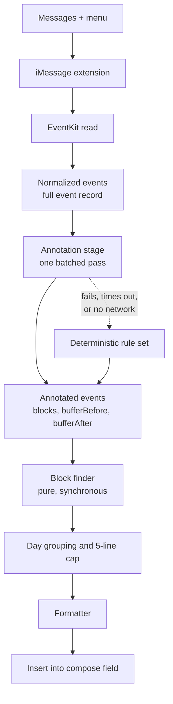

# Mobile Availability Generator - Plan

## Goal Capsule

- **Objective:** From inside a Messages conversation, in two taps and without typing, drop the owner's next open days into the compose field as plain text.
- **Means:** A native iOS app whose iMessage extension appears in the Messages `+` menu, reading Apple Calendar through EventKit and computing availability in Swift.
- **Product authority:** Single user, single device, personal use. No other users, no accounts, no App Store distribution. Inference-driven behavior is named here only as the seam it will plug into; both inference features are separate work.
- **Open blockers:** None.

---

## Product Contract

### Summary

Rebuild `avail` as a native iOS app. Its iMessage extension sits in the Messages `+` menu; tapping it inserts the next five days that have open time into the compose field, one line per day, in the original text format. Everything runs on-device in Swift. A single annotation stage sits between reading the calendar and computing blocks, so later AI-driven buffer and all-day-event behavior drops in without touching anything downstream.

### Problem Frame

Sending someone your availability is a thirty-second interruption in the middle of a text conversation, and every existing path costs more than that. Opening the Calendar app and reading the week off the screen means transcribing times by hand and getting them wrong. Scheduling links move the work to the other person and read as bureaucratic between people who just want to pick a time. The original `avail` solved the formatting problem well — its compact output is still the thing worth sending — but it only ran as a Node CLI fed a JSON dump from a Google Calendar OAuth server, so it was never reachable at the moment the question gets asked. The gap is not the computation. It is that the computation is nowhere near the conversation.

### Key Decisions

- **A native iOS app with an iMessage extension.** (session-settled: user-directed — chosen over a Shortcuts-and-Scriptable path, and over shipping the Shortcut first with the extension later: the Messages `+` menu is populated only by iMessage app extensions, and that entry point is the point.) Governs R14, R15, R16.
- **The whole implementation is Swift.** (session-settled: user-directed — chosen over running the existing JavaScript through JavaScriptCore, and over keeping the JS as a cross-check oracle: one language and full Xcode debugging beat reusing the old module.) Governs R24, R25.
- **One fixed rule set, no invocation-time prompts.** (session-settled: user-directed — chosen over preset variants and per-run prompting: speed mid-conversation beats flexibility.) Governs R14.
- **One line per day, capped at five.** (session-settled: user-directed — chosen over one line per block, collapsing identical runs, and longest-first selection: the message stays glanceable, and day granularity still reaches late in the window when early days are booked.) Governs R9, R10, R11.
- **The line cap binds, not the horizon.** (session-settled: user-directed — chosen over returning fewer lines or an empty result when the week is full: five real days are always more useful than a short list, and any day past the last calendar event is fully open, so the search always terminates.) Governs R2a, R11.
- **Annotation is a single pre-pass over events, never a call inside block finding.** (session-settled: user-approved — chosen over resolving buffers inline during the scan: keeps block finding pure, synchronous and snapshot-testable once inference lands.) Governs R17, R18, R23.
- **The event model captures the full event record.** (session-settled: user-directed — chosen over times-and-location-only and a locally-computed in-person flag: privacy is not a constraint here, and full detail leaves the most headroom for later semantic features.) Governs R22.
- **Both inference-dependent behaviors are deferred, and they share one seam.** (session-settled: user-directed — distance-based buffer durations and treating travel and conference all-day events as blocking are separate tasks; this work builds only what they plug into.) Governs R19, R20.
- **The day window widened from the original, and weekends stayed in.** (session-settled: user-directed — chosen over the original's 9-to-5 and over weekdays-only: weekends are ordinary available days.) Governs R1.
- **The containing app carries the calendar selection and a live preview.** (session-settled: user-directed — chosen over a permission-prompt-only shell, a full settings screen, and preview-only: calendars come and go while hours never change, and the preview verifies a rule change without texting yourself.) Governs R26, R27, R28.
- **A calendar's own Show As field is honored.** (session-settled: user-directed — chosen over blocking everything that has a time on it, and over honoring it only on events the owner created: it is a per-event override that needs no new configuration.) Governs R7a.
- **The repository is replaced, not extended.** The Google OAuth server, the stdin CLI, and the JavaScript implementation all go. The block-finding algorithm and the output format are the only things that survive, and they survive as a specification to reimplement rather than as code.

### Pipeline shape

Swift owns everything with a side effect: the EventKit read, any network the annotator later needs, and the insertion. The annotation stage is the only place inference will ever run, and everything downstream of it is a pure function of its output.

### Requirements

**Availability rules**

- R1. Free time is computed within a daily window of 9:00am to 7:00pm local time, on every day of the week including weekends.
- R2. The preferred window is the next 7 days from the moment of invocation, extended to 8 or 9 days when day 7 would fall on a Monday or Tuesday, so the preferred window never ends on either of those days.
- R2a. The preferred window is not a ceiling: when it holds fewer than five qualifying days, the search continues day by day past it until five qualifying days are found.
- R3. A free block shorter than one hour is not offered.
- R4. Today's availability begins at the current time rounded up to the next half hour.
- R5. Every calendar blocks availability except those the owner has excluded in the containing app; `Supportive and Nourishing Structure` is excluded at first run.
- R6. All-day events never block availability.
- R7. Declined invitations do not block availability; tentatively accepted events do.
- R7a. An event whose Show As field reads Free does not block availability, whoever owns it.
- R8. Each blocking event excludes a buffer before and after itself from availability, currently 15 minutes on each side.

**Output format**

- R9. Availability renders one line per day: the day's date prefix once, followed by all of that day's free blocks separated by commas.
- R10. A day with no qualifying free block produces no line.
- R11. Exactly five lines are emitted whenever the calendar permits, taken in chronological order, with any remainder inside the preferred window dropped and no truncation marker.
- R12. Block times use the original compact form `h[:mm]am/pm`, with the start's am/pm suffix omitted when that block's start and end fall in the same half of the day.
- R13. Times render in the device's local timezone with no timezone label.

**Invocation and delivery**

- R14. The iMessage extension appears in the Messages `+` menu and generates availability on a single tap, with no prompt for hours, horizon, or any other parameter.
- R14a. When calendar access has not been granted, the extension reports the permission state rather than rendering an empty list.
- R15. The generated text is inserted into the active conversation's compose field, leaving the owner to review, edit, and send.
- R16. The deterministic result is produced entirely on-device and completes with no network connection.

**Annotation seam**

- R17. A single annotation stage runs after events are read and before free-block computation, returning for each event whether it blocks and its before and after buffer durations.
- R18. The annotation stage resolves every event in the window in one batched pass, not one call per event.
- R19. The shipped annotator is a deterministic rule set implementing R6, R7 and R8, and is replaceable without changes downstream of it.
- R20. When an annotator errors, times out, or has no network, the deterministic rule set supplies the annotation and generation completes normally.
- R21. Annotation results derived from a stable external fact are cached across invocations, keyed on the inputs that determine them.
- R22. The normalized event model captures the full event record: title, notes, location, conferencing URL, attendees, calendar, start, end, all-day flag, and response status.
- R23. Free-block computation consumes only event times and the annotation stage's output, and is a pure synchronous function of them.

**Containing app**

- R26. The containing app lists the device's calendars and lets the owner mark each as blocking or excluded, and the extension reads that selection.
- R27. The containing app displays the exact text the extension would produce at that moment.
- R28. The daily window, the line cap, the minimum block, and the buffer durations are build-time constants, not editable on-device.

**Structure**

- R24. The availability rules, block finding, and formatting live in a Swift module that imports neither EventKit nor any UI framework, and is exercised directly by unit tests over fixture event lists.
- R25. The iMessage extension and its containing app are shells over that module: the EventKit read, the compose-field insertion, and any future network call live outside it.
- R25a. The calendar selection from R26 and the annotation cache from R21 are shared between the containing app and the extension.

### Key Flows

- F1. Generate and insert availability
  - **Trigger:** Owner taps `+` in a Messages conversation and selects the extension.
  - **Steps:** The extension reads events across the horizon per R2 and R2a and normalizes them per R22; the annotation stage resolves blocking and buffers per R17; the block finder computes free blocks within the daily window; days are grouped and capped per R9 through R11; the formatter renders the text per R12 and R13; the text is placed in the compose field.
  - **Outcome:** Five lines of availability sit in the compose field, unsent.
  - **Covered by:** R1-R16, R22, R23.
- F2. Annotation unavailable
  - **Trigger:** The annotator errors, exceeds its time budget, or the device has no network.
  - **Steps:** The deterministic rule set supplies annotations for every event; the rest of F1 proceeds unchanged.
  - **Outcome:** The owner gets the deterministic list with no error surfaced and no missing days.
  - **Covered by:** R19, R20.
- F3. Adjust which calendars block
  - **Trigger:** Owner opens the containing app after adding or renaming a calendar.
  - **Steps:** The app lists every calendar on the device with its current blocking state; the owner toggles one; the preview re-renders against the new selection.
  - **Outcome:** The selection is stored where the extension reads it, and the preview shows what the next invocation will produce.
  - **Covered by:** R5, R25a, R26, R27.
- F4. Calendar access not yet granted
  - **Trigger:** The extension runs before EventKit permission has been granted.
  - **Steps:** The extension surfaces the permission state rather than an empty result and directs the owner to grant access through the containing app.
  - **Outcome:** The owner understands why no availability appeared and can fix it.
  - **Covered by:** R14a.

### Acceptance Examples

- AE1. **Covers R2.** Given today is Monday, when availability is generated, then the preferred window spans 9 days so it ends on Wednesday.
- AE2. **Covers R2.** Given today is Tuesday, when availability is generated, then the preferred window spans 8 days so it ends on Wednesday.
- AE3. **Covers R2.** Given today is Thursday, when availability is generated, then the preferred window spans exactly 7 days.
- AE4. **Covers R9, R12.** Given Tuesday has a meeting from 2:30pm to 3:30pm and no other events, when the line renders, then it reads `Tue 7/11 9am-2:15pm, 3:45-7pm`.
- AE5. **Covers R10, R11.** Given the first two days of the window are fully booked and the following six are open, when availability renders, then the first line is day 3 and exactly five lines are emitted, ending at day 7.
- AE5a. **Covers R2a.** Given every day in the preferred window is fully booked and the five days after it are open, when availability renders, then five lines are emitted for those later days rather than an empty result.
- AE5b. **Covers R2a.** Given only two days inside the preferred window qualify, when availability renders, then the search continues past the window until five qualifying days are found.
- AE6. **Covers R3.** Given Wednesday has meetings leaving only a 45-minute gap and a 3-hour gap, when the line renders, then only the 3-hour block appears.
- AE7. **Covers R6.** Given Thursday holds an all-day event and no timed events, when the line renders, then it reads as fully open for the whole 9am-7pm window.
- AE8. **Covers R5.** Given Friday holds a 10am event on the `Supportive and Nourishing Structure` calendar and no other events, when the line renders, then it reads as fully open.
- AE9. **Covers R7.** Given Saturday holds one declined invitation and one tentatively accepted event, when the line renders, then only the tentative event removes time.
- AE10. **Covers R4.** Given it is 2:10pm today, when availability is generated, then today's first block starts at 2:30pm.
- AE11. **Covers R20.** Given the annotator throws on every event, when availability is generated, then the output is identical to a run with the deterministic rule set and no error reaches the compose field.
- AE12. **Covers R15.** Given availability generates successfully, when the extension finishes, then the text sits in the compose field unsent and the owner can edit it before sending.
- AE13. **Covers R7a.** Given Monday holds a two-hour event whose Show As reads Free, when the line renders, then it reads as fully open.
- AE14. **Covers R26, R27.** Given the owner excludes a calendar in the containing app, when the preview refreshes, then blocks previously removed by that calendar's events appear, and the extension's next run matches the preview.

### Success Criteria

- Tap to populated compose field completes in a few seconds in airplane mode.
- The R24 module's behavior is pinned by unit tests over fixture event lists, with no simulator UI and no calendar access required to run them.
- Introducing the distance-based buffer annotator later requires changes only inside the annotation stage — not in block finding, day grouping, formatting, or the extension.
- The extension stays within the memory budget iOS allows a Messages extension across a full nine-day window.

### Scope Boundaries

- Distance-based buffer durations, and the carve-out that makes travel and conference all-day events blocking, are both separate work. This plan builds the seam and the deterministic annotator only.
- Semantic or fuzzy qualifiers ("mornings only", "after my trip") are out. Generation is fully deterministic.
- Email injection is out. An iMessage extension lives only in Messages, so that case needs a different surface — the containing app or a share extension — and is not designed here.
- Shortcuts, Scriptable, and any share-sheet entry point are out.
- Any server, daemon, hosted endpoint, or CalDAV path is out.
- App Store distribution, multi-user support, accounts, and authentication are out.
- The existing Express OAuth server, Google Calendar integration, stdin CLI, and JavaScript implementation are all removed.

### Dependencies / Assumptions

- A paid Apple Developer Program membership is a liveness dependency, not a one-time cost: if it lapses the app stops launching on the device. Free provisioning expires every seven days and is not a viable fallback.
- Xcode and a Mac are required to build and sign; the phone is not an authoring surface.
- iOS provides no way to send a message programmatically from a Messages extension, so R15 stops at insertion by platform constraint rather than by choice.
- EventKit permission is requested by the containing app; the extension inherits it and cannot prompt for it usefully on its own.
- The containing app holds the extension, owns the permission prompt, and carries the calendar selection and preview described in R26 and R27.
- The buffer in R8 is symmetric and uniform today only because the deterministic annotator makes it so; nothing downstream assumes symmetry.

### Outstanding Questions

**Deferred to Planning**

- How the R25a shared store is implemented and when cache entries expire.
- Whether the comma separator in R9 is the right glue for a day with three or more blocks.
- How far forward the R2a search may run before it is treated as a fault rather than a genuine answer.

### Sources / Research

- `find-free-blocks.js` — the recursive free-block algorithm and the formatter to reimplement in Swift, including the per-block am/pm elision in `formatBlockStart` and the original defaults (9am-5pm, all seven days, 1-hour minimum, 7-day span). Specification, not carried code.
- `test/events.json` and `test/spec.js` — existing fixtures and expected outputs that port directly into the Swift test suite.
- `index.js` and `bin.js` — the Express/Passport OAuth server and the stdin CLI being removed.
- [Use iMessage apps on your iPhone and iPad](https://support.apple.com/en-us/104969) and [Intro to Message app extensions](https://learn.microsoft.com/en-ca/previous-versions/xamarin/ios/platform/message-app-integration/intro-to-message-app-extensions) — establish that the `+` menu is populated exclusively by iMessage app extensions, which is why a native app is required.
- [Building an interactive iMessage application](https://medium.com/@bartkozal/building-an-interactive-imessage-application-for-ios-10-in-swift-7da4a18bdeed) — an extension can insert a message into the conversation, but the owner must confirm the send; there is no programmatic send.
